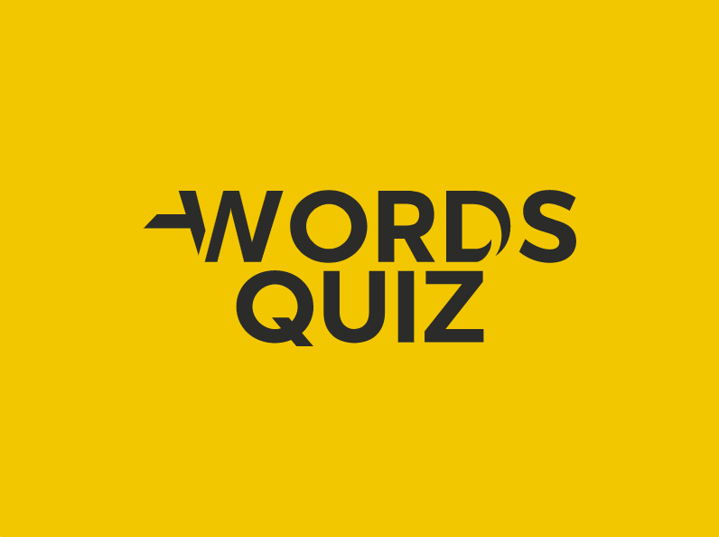

<!-- PROJECT LOGO -->
<br />
<p align="center">
  <a href="https://github.com/YunusEmreAlps/Flutter_Words_Quiz/tree/master/words_quiz">
    
  </a>

  <h3 align="center">Words Quiz</h3>

  <p align="center">
    Let's Play
    <br />
    <a href="https://github.com/YunusEmreAlps/Flutter_Words_Quiz">Download</a>
    ·
    <a href="https://github.com/YunusEmreAlps/Flutter_Words_Quiz/issues">Report Bug</a>
    ·
    <a href="https://github.com/YunusEmreAlps/Flutter_Words_Quiz/issues">Request Feature</a>
  </p>
</p>


<!-- TABLE OF CONTENTS -->
<details open="open">
  <summary>Table of Contents</summary>
  <ol>
    <li>
      <a href="#about-the-project">About The Project</a>
      <ul>
        <li><a href="#built-with">Built With</a></li>
      </ul>
    </li>
    <li>
      <a href="#getting-started">Getting Started</a>
      <ul>
        <li><a href="#prerequisites">Prerequisites</a></li>
        <li><a href="#clone">Clone</a></li>
      </ul>
    </li>
    <li><a href="#usage">Usage</a></li>
    <li><a href="#roadmap">Roadmap</a></li>
    <li><a href="#contributing">Contributing</a></li>
    <li><a href="#contact">Contact</a></li>
    <li><a href="#Screenshots">Screenshots</a></li>
  </ol>
</details>


<!-- ABOUT THE PROJECT -->
## About The Project
Our quiz app contains a total of three-screen, the welcome screen where a user tap screen than the main screen called the questions screen. Each question has 4 options once the user click on the option if the answer is correct then it turns green otherwise red. At the end score screen where you can check your score.

This is a complete functional **Quiz App With Timer In Flutter** that works on both Android and iOS devices. For state management, we use the getX package.


- [x] Light Mode / Dark Mode
- [x] Multiple Screens
- [x] Timer (60 sec)
- [x] The number of questions is 100
- [x] Result Page

### Built With

* [Flutter](https://flutter.dev)
* [GetX](https://pub.dev/packages/get)
* cupertino_icons
* provider
* google_fonts
* flutter_svg
* websafe_svg


<!-- GETTING STARTED -->
## 🚀 Getting Started

### Prerequisites

To run any Android application built with Flutter you need to configure the enviroments in your machine, you can do this following the the tutorial provided by Google in [Flutter website](https://flutter.dev/docs/get-started/install)

- Flutter SDK
- Android Studio (to download Android SDK)
- Xcode (for iOS develop only)
- Any IDE with Flutter SDK installed (ie. IntelliJ, Android Studio, VSCode etc)
- A little knowledge of Dart and Flutter

### Clone

- Clone this repo to your local machine using:

```
git clone https://github.com/YunusEmreAlps/Flutter_Words_Quiz.git
```

### Setup

To run the app you need to have an online emulator or a plugged device and run the following command in the root of the application.

#### Android
```
flutter run
``` 
### iOS (_MAC Only_)

```
flutter run
``` 

<!-- ROADMAP -->
## Roadmap

See the [open issues](https://github.com/YunusEmreAlps/Flutter_Words_Quiz/issues) for a list of proposed features (and known issues).


<!-- CONTRIBUTING -->
## 🤔 Contributing

Contributions are what make the open source community such an amazing place to be learn, inspire, and create. Any contributions you make are **greatly appreciated**.

1. Fork the Project
2. Create your Feature Branch (`git checkout -b feature/AmazingFeature`)
3. Commit your Changes (`git commit -m 'Add some AmazingFeature'`)
4. Push to the Branch (`git push origin feature/AmazingFeature`)
5. Open a Pull Request


<!-- LICENSE -->
## 📝 License

Distributed under the MIT License. See `LICENSE` for more information.


<!-- CONTACT -->
## 📌 Contact

- Linkedin at [Yunus Emre Alpu](https://www.linkedin.com/in/yunus-emre-alpu-5b1496151/)

<!-- SCREENSHOTS -->
## Screenshots

Light Mode (Splash Screen) |  Dark Mode   (Splash Screen)           | Light Mode  (Splash Screen)             |  Dark Mode (Splash Screen)
:-------------------------:|:-------------------------:|:-------------------------:|:-------------------------:
||||

Light Mode  (Splash Screen) |  Dark Mode (Splash Screen)  | Light Mode             |  Dark Mode
:-------------------------:|:-------------------------:|:-------------------------:|:-------------------------:
||||


Light Mode                  |  Dark Mode              | Light Mode              |  Dark Mode
:-------------------------:|:-------------------------:|:-------------------------:|:-------------------------:
||||

Light Mode  (Score Page)                |  Dark Mode  (Score Page)            | Light Mode              |  Dark Mode
:-------------------------:|:-------------------------:|:-------------------------:|:-------------------------:
||||


